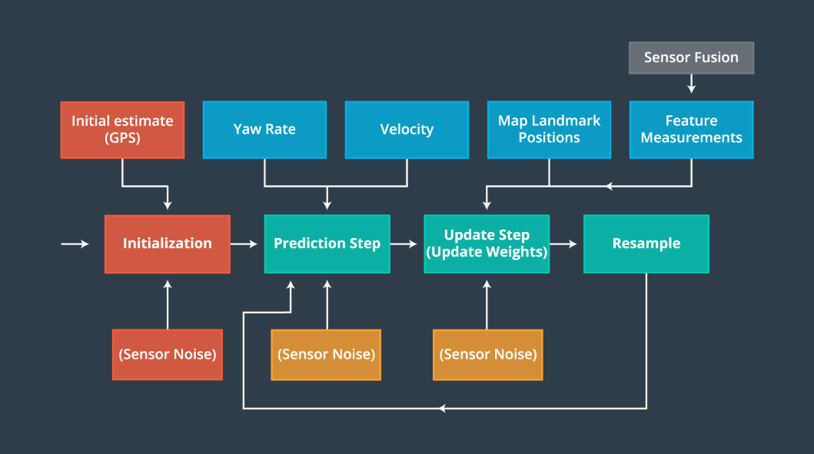
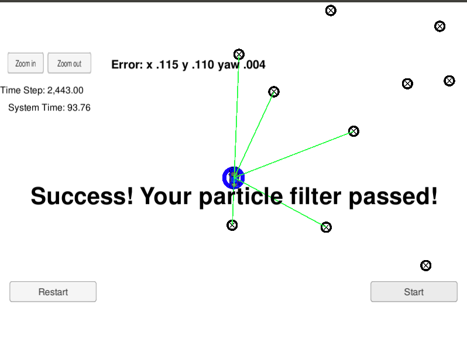

# Overview
This project implements a 2D particle filter given sparse landmarks and noisy measurements. The vehicle is localized to a general area using an initial estimate from measurements similar to GPS. Then, given the vehicle velocity and yaw rate, as well as bearing and range measurements to different landmarks we maximize the posterior probabilities by determining which measurements are most likely.

## Running the Code
This project uses Udacity's Term 2 [Simulator] (https://github.com/udacity/self-driving-car-sim/releases)

This repository includes two files that can be used to set up and install uWebSocketIO for either Linux or Mac systems. For windows you can use either Docker, VMware, or even Windows 10 Bash on Ubuntu to install uWebSocketIO.

Once the install for uWebSocketIO is complete, the main program can be built and ran by doing the following from the project top directory.

1. mkdir build
2. cd build
3. cmake ..
4. make
5. ./particle_filter

## Inputs to the Particle Filter
The inputs to the particle filter are located in the `data` directory.

## The Map*
`map_data.txt` includes the position of landmarks (in meters) on an arbitrary Cartesian coordinate system. Each row has three columns
1. x position
2. y position
3. landmark id

## Success Criteria

1. **Accuracy**: your particle filter should localize vehicle position and yaw to within the values specified in the parameters `max_translation_error` and `max_yaw_error` in `src/main.cpp`.

2. **Performance**: your particle filter should complete execution within the time of 100 seconds.

